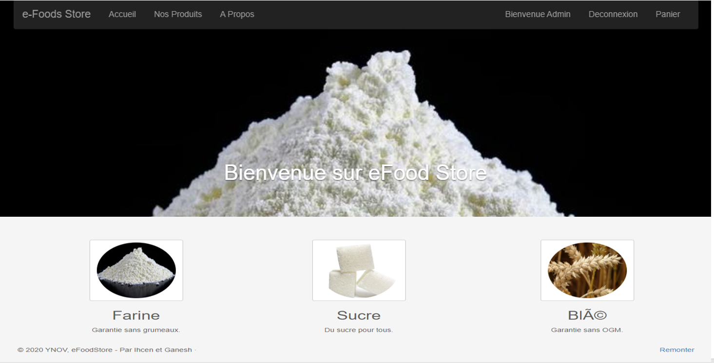
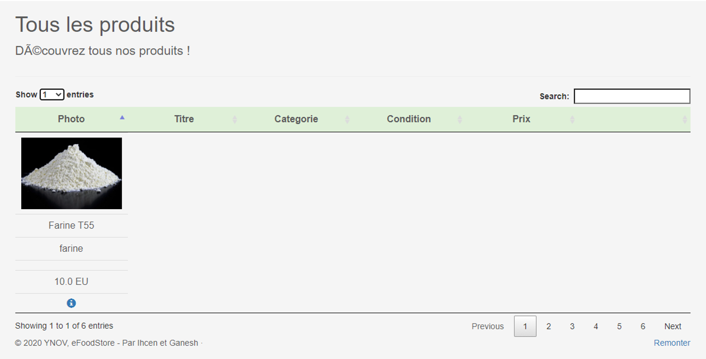
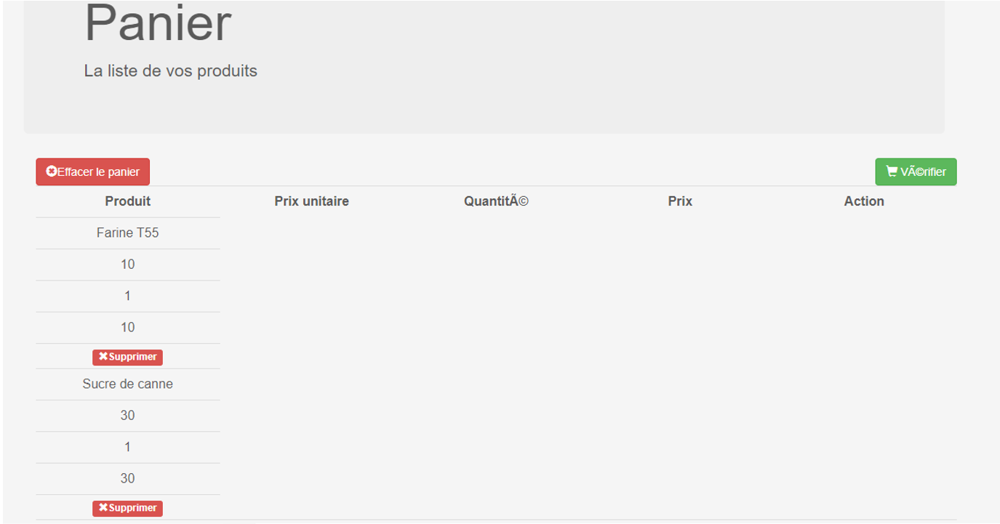
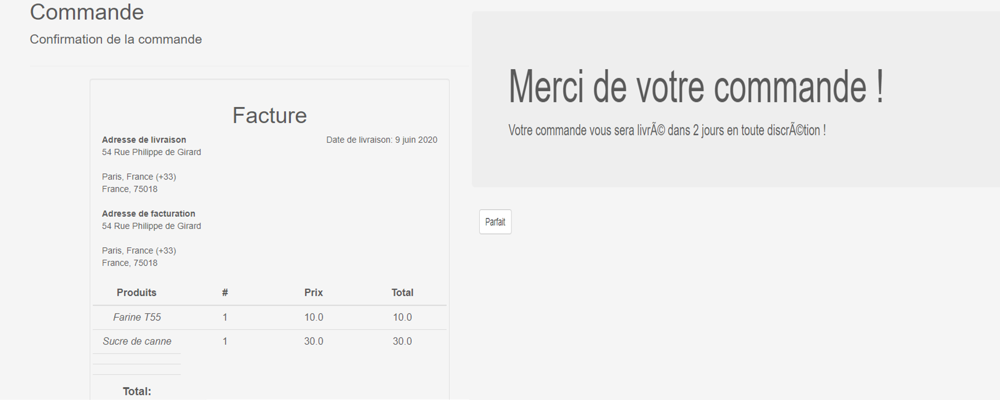
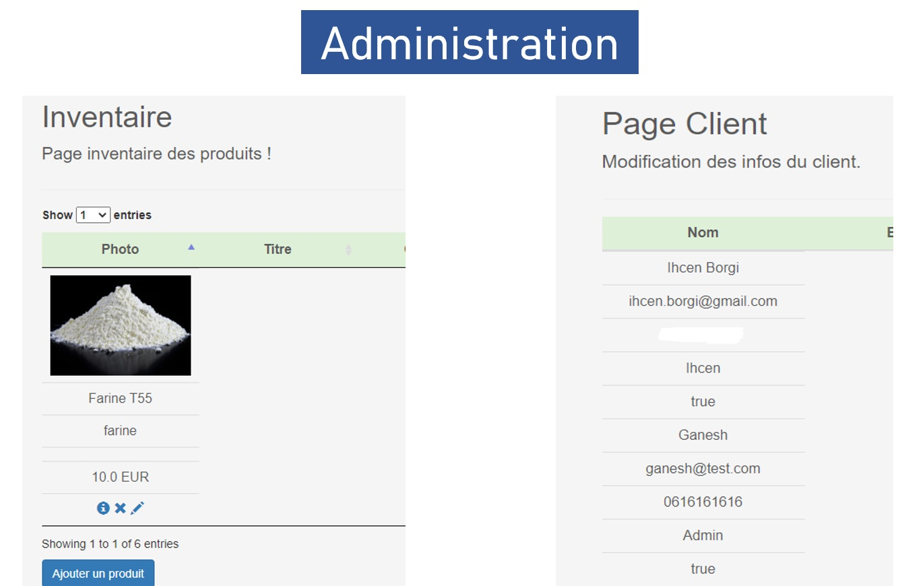

# eFoodStore - The best Food's store

Un site ecommerce en J2E. 
Le but est de créer une IHM de type CRUD qui s’adaptera à tout modèle de données. 

## To start app : 
- Launch Project from IntelliJ IDEA as TOMCAT project. 

## Requierements : 
- TomCat 8 
- IntelliJ IDEA
- JDK 8

## Technos : 
- Spring
- Maven
- Hibernate

## Image du site 

